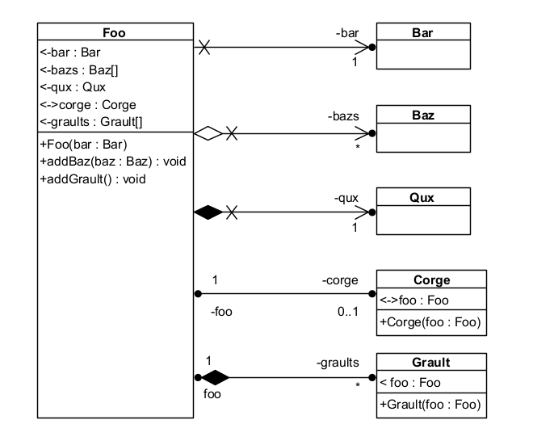

# Foo-Bar-Baz-Qux-Corge-Grault

# Association - Agrégation - Composition

# Made with ❤️ by [JAD](mailto:jeanaymeric@gmail.com)

## Objectif :

Implémenter en Java le diagramme de classes suivant :

## Validation

Des tests unitaires sont fournis pour valider votre implémentation.

À chaque commit and push, les tests sont exécutés automatiquement par GitHub Actions.

Pour visualiser les résultats des tests, cliquez sur l'onglet "Actions" de votre dépôt GitHub.

Pour le moment, aucune méthode n'est implémentée, donc les tests échouent.
Ce n'est pas parce qu'une méthode n'est pas présente qu'elle n'est pas nécessaire.
Lisez attentivement le diagramme de classes.